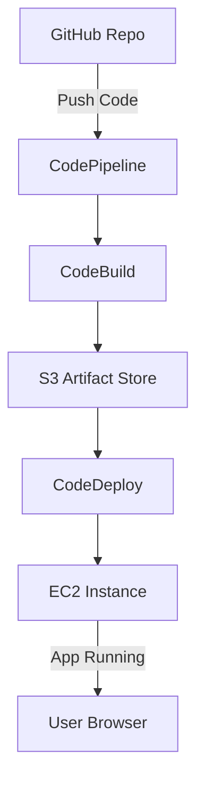

# 🏗️ Terraform CI/CD Pipeline for Node.js App on AWS

This project demonstrates how to build a **CI/CD pipeline using Terraform** on AWS. It provisions a pipeline that automatically deploys a Node.js web application from GitHub to EC2 using CodePipeline, CodeBuild, and CodeDeploy.  

---

## 📐 Architecture



---

## 🛠 Prerequisites

- AWS account with admin access  
- Terraform installed (`>=1.3`)  
- GitHub repository (your Node.js app + `buildspec.yml` + `appspec.yml`)  
- AWS CLI configured (`aws configure`)  
- IAM permissions to create roles, policies, pipelines  

---

## ⚡ Setup Instructions

### 1️⃣ Clone the Repository
```bash
git clone https://github.com/<your-username>/<repo-name>.git
cd <repo-name>

Sample :
git clone https://github.com/astrogazer22/cicd-codepipeline-terraform.git
cd cicd-codepipeline-terraform
```

### 2️⃣ Initialize Terraform
```bash
terraform init
```

### 3️⃣ Validate & Plan Infrastructure
```bash
terraform plan
```

### 4️⃣ Apply Infrastructure
```bash
terraform apply -auto-approve
```

---

## 🔄 CI/CD Flow

1. **Developer pushes changes** → GitHub  
2. **CodePipeline triggers** → detects new commit  
3. **CodeBuild runs build** → executes `buildspec.yml`  
4. **Artifacts stored in S3** → zipped output  
5. **CodeDeploy deploys to EC2** → executes `appspec.yml`  
6. **Application available on EC2 public IP**

## 🔗 Approving GitHub Connection in AWS Console

```bash

When using aws_codestarconnections_connection in Terraform for GitHub integration, the connection remains Pending until manually approved in the AWS Console. Without this step, CodePipeline cannot fetch your source code.

Steps to approve the connection:

Go to the AWS Management Console.

Navigate to:
Developer Tools → Connections
(or search for “CodeStar Connections” in the console).

You will see the connection you created with Terraform in Pending state.

Click on the connection name.

Select Update pending connection.

A GitHub authorization pop-up will appear.

Log in with your GitHub account.

Authorize AWS CodePipeline to access your repositories.

After successful authorization, the connection status should change to Available.

✅ Once the connection is approved, rerun terraform apply or Release Change in CodePipeline, and your pipeline will work correctly.

```

---

## 🛠 Troubleshooting

If deployments fail, run the following commands **on the EC2 instance**.

### Restart CodeDeploy Agent
```bash
sudo systemctl restart codedeploy-agent
sudo systemctl status codedeploy-agent --no-pager
```

### Remove Stale PID Lock Files
```bash
sudo rm -f /opt/codedeploy-agent/deployment-root/deployment-instructions/*_pid.lock
```

### View Logs
```bash
# CodeDeploy agent logs
tail -n 20 /var/log/aws/codedeploy-agent/codedeploy-agent.log

# Deployment logs
tail -n 20 /opt/codedeploy-agent/deployment-root/deployment-logs/codedeploy-agent-deployments.log
```

---

## 🔧 Automated Troubleshooting Script

Save the following as `troubleshoot.sh` on your EC2 instance:

```bash
#!/bin/bash
# Troubleshooting script for AWS CodeDeploy & Node.js app

echo "🔄 Restarting CodeDeploy agent..."
sudo systemctl restart codedeploy-agent
sudo systemctl status codedeploy-agent --no-pager

echo "🧹 Removing stale PID lock files..."
sudo rm -f /opt/codedeploy-agent/deployment-root/deployment-instructions/*_pid.lock

echo "📜 Showing CodeDeploy agent logs..."
tail -n 20 /var/log/aws/codedeploy-agent/codedeploy-agent.log

echo "📜 Showing deployment logs..."
tail -n 20 /opt/codedeploy-agent/deployment-root/deployment-logs/codedeploy-agent-deployments.log

echo "📜 Checking Node.js service logs..."
sudo journalctl -u nodejs -n 20 --no-pager

echo "✅ Troubleshooting completed."
```

Run:
```bash
chmod +x troubleshoot.sh
./troubleshoot.sh
```

---

## ✅ Next Steps
- Add monitoring with **CloudWatch Alarms & Logs**  
- Configure HTTPS with **ACM + ALB**  
- Scale using **Auto Scaling Group** & **Load Balancer**  


